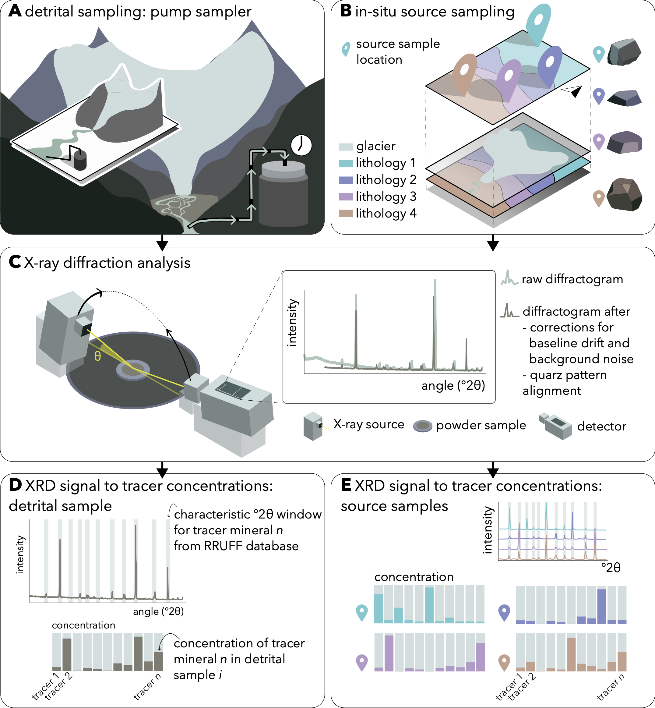
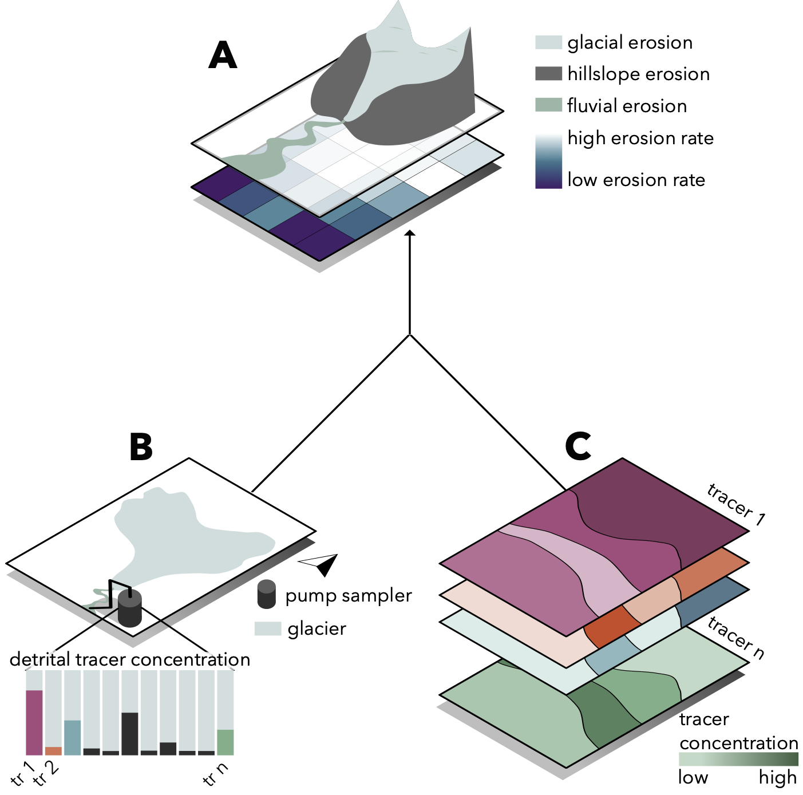
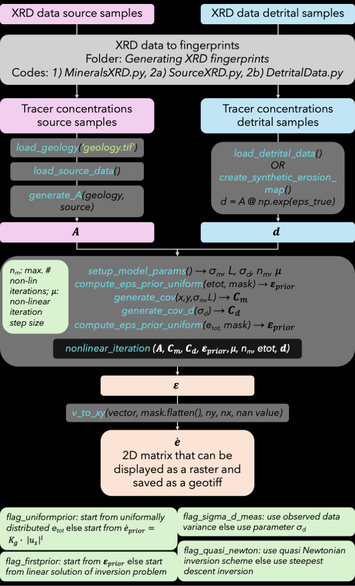

# From XRD data to erosion rate maps
This repository contains the codes and data to reproduce the tests of our article "From XRD signal to erosion rate maps". By binning the corrected peak-area XRD data of both source- and sediment samples, we obtain concentrations for selected tracer minerals. Using a non-linear inversion approach, we are then able to invert the sediment data into erosion maps. Posterior covariance matrices and resolution are indicators of posterior uncertainty.

## Context
Understanding the spatio-temporal patterns of suspended sediment source activations is crucial for downstream risk management. Especially in glacierized catchments it is difficult to study these dynamics, as the processes driving sediment export are covered by ice and are therefore invisible. Hence, using sediment data to infer erosion rates is one of the only methods available to understand the spatial dynamics of sediment provenance in these settings.

In an earlier article, we have shown how to use a linear inversion approach to obtain erosion rate maps from detrital data ([De Doncker et al. 2020](https://onlinelibrary.wiley.com/share/DJAE2KDTVCHECMPACAVR?target=10.1002/esp.5008)). Here, to deal with the non-linear nature of erosion rate distributions, and to avoid negative posterior erosion rates, we formulate a non-linear version of the forward model and we test two inversion schemes: the steepest descent (SD) and the quasi Newtonian (QN) approach.


## Methodology

### Conceptual Workflow
1. (A&B) Sampling of source samples (representative for source areas) and suspended sediment samples at the sink of the catchment
2. (C) XRD analysis of powdered samples and correction of the raw diffractograms
3. (D&E) Binning of the peak areas in characteristic 2theta windows for the selected tracer minerals, using the RRUF database
4. Inversion using the sediment data, the source data, and a geological map

| [](Workflow.png) | 
|:--:| 
| *Figure 1: Visual conceptual workflow.<br>Click on the image to see the full size figure.* |

### Inversion
The detrital data are a weighted average of the tracer mineral concentrations, with the weights being the erosion rates:

$d_i=\ \frac{\sum_{j=1}^{n}{A_{ij}\cdot{\exp(\varepsilon}_j)}}{\sum_{j=1}^{n}{{\exp(\varepsilon}_j)}}\ for\ i=1,\ \ldots m$

Where $d_i$ is the tracer abundance of tracer mineral i in the suspended sediments, $A_{ij}$ is the tracer abundance of tracer mineral $i$ at source position $j$ (pixel $j$), and the erosion rates are modelled in log-space: $\varepsilon_j=\log(\frac{{\dot{e}}_j}{{\dot{e}}_0})$ with  ${\dot{e}}_j$ being the erosion rate at pixel j and ${\dot{e}}_0$ is a reference erosion rate (set to 1) to respect dimensional consistency. We cast the erosion rates in log-space to impose a positivity constraint, hence making this non-linear.

The forward model reads as:

$\mathbf{d}=\mathbf{A}\ \cdot\exp(\boldsymbol{\varepsilon})$

where $\mathbf{d}$ is the sediment data, containing the tracer concentration of each mineral,
$\mathbf{A}$ is the tracer concentration of each mineral, for every pixel,
$\boldsymbol{\varepsilon}$ is a vector containing the logarithm of the erosion rate for every pixel


To infer erosion rates from $\mathbf{d}$ and \mathbf{A}, we use the quasi-newtonian approach:

${\ \boldsymbol{\varepsilon}}_{n+1}=\ \boldsymbol{\varepsilon}_n\ -\ \mu_n\left(\mathbf{G}_n^T\mathbf{C_d}^{-1}\mathbf{G}_n\right)^{-1}\left(\mathbf{G}_n^T\mathbf{C_d}^{-1}\left(\mathbf{d}_n-\mathbf{d}_{obs}\right)+\mathbf{C_m}^{-1}\left(\boldsymbol{\varepsilon}_k-\boldsymbol{\varepsilon}_{prior}\right)\right)$

or the steepest descent approach:

$\boldsymbol{\varepsilon}_{n+1}=\ \boldsymbol{\varepsilon}_n\ -\ \mu_n({\mathbf{C_m}\mathbf{G}}_n^T\mathbf{C_d}^{-1}\left(\mathbf{d}_n-\mathbf{d}_{obs}\right)+(\boldsymbol{\varepsilon}_k-\boldsymbol{\varepsilon}_{prior}))$

where $\mathbf{G}_n$ is the Jacobian at iteration $n$, $\mathbf{C_m}$ is the model covariance, $\mathbf{C_d}$ is the data covariance and $\mu_n$ is the step size.


| [](Inverse_flow.png) | 
|:--:| 
| *Figure 2: From detrital data and spatial information on tracer concentrations to an erosion rate map: <br>A: erosion rate map (raster) reflecting different erosion processes, <br>B: tracer concentrations in suspended sediments, <br>C: tracer concentration maps based on geology and lithological fingerprints.<br>Click on the image to see the full size figure.* |

### The codes
In the folder ```Forward-Inverse testing``` you can find ```Forward_Inverse_SaveResults_AllTests.py``` to test the different scenarios and the different hyperparameter values.

In the folder ```Generating XRD Fingerprints``` you can find different scripts to run in the following order:
1. ```MineralsXRD.py``` to get the 2theta windows of the selected tracer minerals
2. ```DetritalDataXRD.py```and ```SourceXRD.py``` that generate ```.pkl``` files (in ```.\INPUT\XRD_data```)

In the folder ```Zircon testing``` you can find the scripts to a) generate the zircon source- and detrital data, and b) to run the inversion with the XRD detrital data and with the zircon detrital data.

| [](Flow_code.png) | 
|:--:| 
| *Figure 3: Workflow in this repository.<br>Click on the image to see the full size figure.* |

## Limitations

* Sources must have distinct mineralogies
* Correct spatial delineation of source areas is crucial
* Multiple tracer minerals must be available
* Sediment storage is minimal

## Project Structure
```
.
├── Forward-Inverse testing/
│   └──  Forward_Inverse_SaveResults_AllTests.py  # Test parameters and scenarios
├── Generating XRD fingerprints/
│   ├── DetritalData.py         # XRD data to detrital fingerprints
│   ├── INPUT/                  # Raw XRD data and RRUFF files
│   ├── MineralsXRD.py          # Get 2theta windows for selected minerals via RRUFF files
│   └── SourceXRD.py            # XRD data to source fingerprints
├── INPUT/          # Input for forward-inverse testing
├── OUTPUT/         # Results of tests
├── README.md       # This file
├── requirements.txt       # Python dependencies
├── Zircon testing/ 
│   ├── Generate_Zircon_Fingerprints.py         # Generate zircon detrital and source fingerprints
│   ├── NonLinear_ZirconSamples.py              # Run the inversion on the detrital zircon data
│   └── Zircon_Data_to_Generate_fingerprints/   # Raw zircon data
```

## Key Libraries

* Numpy – Matrix handling
* Rasterio and Geopandas – Geospatial data (rasters and shapefiles)
* Scipy and Sklean – Computing distinctness of source signals, reducing number of tracer minerals
* Matplotlib and Seaborn – Plotting and colours
